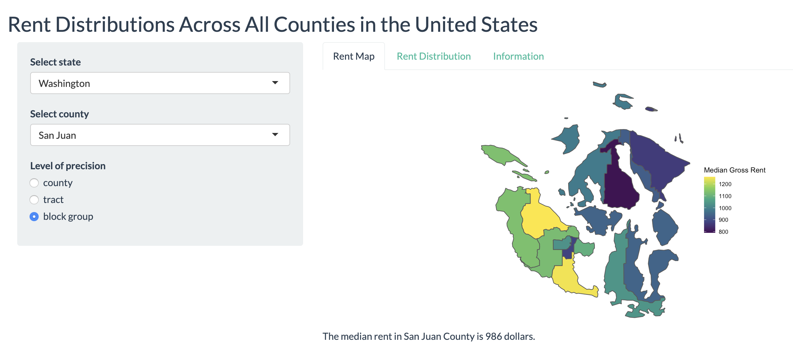

# rent-app

A {shiny} app providing data visualizations for rent in all counties throughout the United States. This app was created by Grayson White as a project for Math 241: Data Science at Reed College in spring 2020. The goal of this app is to allow the public to explore the distribution of rent in any county in the United States and better understand the rent in counties relevent to their interests.

The data were obtained from the US Census Bureau with the `tidycensus` package in R. For more information on the data used in this app, you can visit the [tidycensus webpage](https://walkerke.github.io/tidycensus/).
